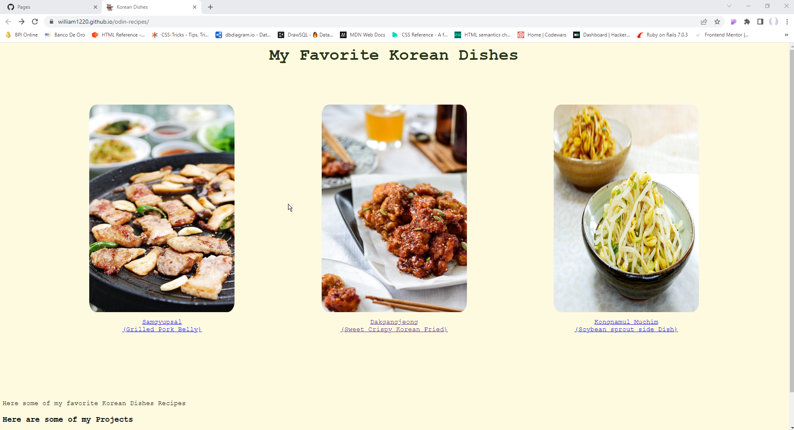

 

  

  <h3 align="center">odin-recipes</h3>

  

    Foundations: (Recipes)
     
     
    <a href="https://github.com/william1220/odin-recipes">View Demo</a>
  

 

## Table Of Contents

* [About the Project](#about-the-project)
* [Built With](#built-with)
* [Contributing](#contributing)
* [Authors](#authors)
* [Acknowledgements](#acknowledgements)

## About The Project

This a basic web page made from basic HTML and CSS. This is based the Odin Project . The free Web Developer course online.

The content of this page(The recipe contents) is derived from other sources of website. I do not own the content of recipe. This Page is basically made for learning purpose. NO COPYRIGHT INFRINGEMENT INTENDED.

## Built With

The Web Page is made of HTML and CSS. 

## Authors

* **william1220** - *Graduate of Le Wagon Bootcamp* - [william1220](https://github.com/william1220/) - *I created It*

## Acknowledgements

* [Korean Bapsang](https://www.koreanbapsang.com/)

